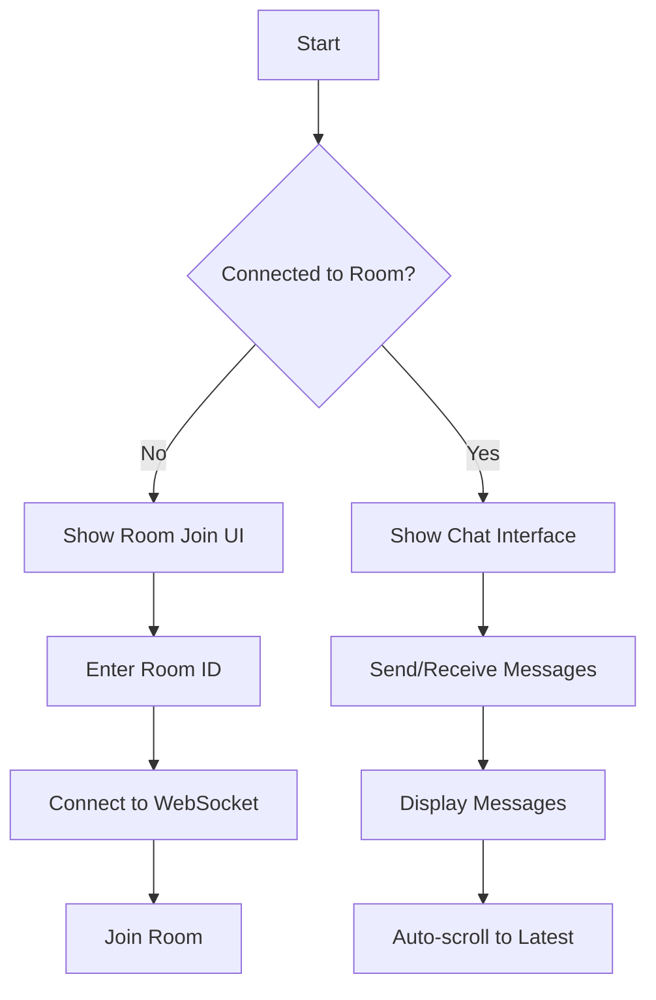
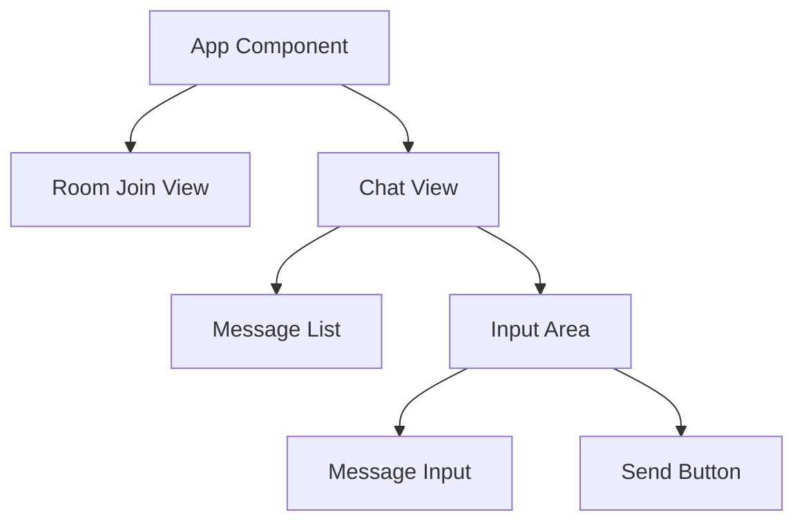

# VCHAT FR - Real-time Chat Application

A modern, real-time chat application built with React, TypeScript, and WebSocket technology. VCHAT FR provides a seamless and responsive chatting experience with a sleek, dark-themed interface.

## 🌟 Features

- Real-time messaging
- Room-based chat system
- Modern dark theme UI
- Responsive design
- Instant message delivery
- Auto-scroll to latest messages
- Enter key support for sending messages

## 🔧 Technology Stack

- **Frontend:**
  - React 19
  - TypeScript
  - Tailwind CSS
  - shadcn/ui components
  - Vite

- **Communication:**
  - WebSocket Protocol
  - JSON message format

## 🔄 Application Flow



## 📡 WebSocket Message Format

### Join Room Message
```json
{
  "type": "join",
  "payload": {
    "roomId": "string"
  }
}
```

### Chat Message
```json
{
  "type": "chat",
  "payload": {
    "message": "string"
  }
}
```

## 🏗️ Component Structure



## 🚀 Getting Started

1. Clone the repository
2. Install dependencies:
   ```bash
   npm install
   ```
3. Start the development server:
   ```bash
   npm run dev
   ```
4. Open your browser and navigate to the provided local URL

## 💻 Usage

1. Enter a room ID to join or create a new room
2. Start chatting in real-time with others in the same room
3. Messages are delivered instantly to all room participants
4. Use Enter key or Send button to send messages

## 🎨 UI Features

- Clean, minimalist design
- Dark theme for reduced eye strain
- Responsive layout for all screen sizes
- Smooth animations and transitions
- Clear message separation
- Auto-scrolling message view

## ⚙️ Development

### Prerequisites
- Node.js 18+
- npm or yarn
- Modern web browser

### Build for Production
```bash
npm run build
```

### Lint Code
```bash
npm run lint
```

## 🔐 Security Considerations

- WebSocket connections are established directly with the server
- Messages are validated before processing
- Room IDs are required for chat access
- Input sanitization is implemented

## 🤝 Contributing

1. Fork the repository
2. Create your feature branch
3. Commit your changes
4. Push to the branch
5. Open a Pull Request

## 📄 License

This project is licensed under the MIT License - see the [LICENSE](LICENSE) file for details.

## 🎯 Future Enhancements

- User authentication
- Persistent message history
- File sharing capabilities
- User typing indicators
- Read receipts
- Private messaging
- Custom room settings
- Emoji support
- Message reactions
